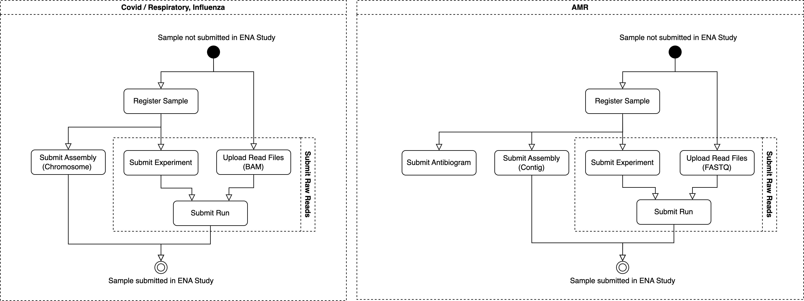

# ENA Sample Submission Automation Script

This repository contains a Python script designed to automate the submission process of biological samples to the European Nucleotide Archive (ENA). It specifically supports the submission of COVID-19 / Respiratory, Influenza, and Antimicrobial resistance samples. The script is configured to handle the submission of one sample at a time.

## Table of Contents
- [Overview](#overview)
- [Submission Process](#submission-process)
  - [Flowchart Diagrams](#flowchart-diagram)
  - [1. Register Sample](#1-sample-registration)
  - [2. Submit Raw Reads](#2-submit-raw-reads)
  - [3. Submit Assembly](#3-submit-assembly)
- [Pre-requirements](#pre-requirements)
- [JSON Config File Structure](#json-config-file-structure)
- [Running the Script](#running-the-script)

## Overview
This script automates the following key steps involved in submitting samples to the ENA:
1. **Sample Registration** using the ENA API.
2. **Raw Reads Submission** to the ENA, including file upload to the FTP server and metadata submission.
3. **Assembly Submission** using the ENA Webin CLI.

## Submission Process

### Flowchart Diagram
Below is a flowchart diagram that illustrates the submission process:



### 1. Register Sample
Sample registration is performed via the ENA API, using a Sample Set XML and a Submission XML. Detailed information about these files can be found in the [ENA programmatic submission documentation](https://ena-docs.readthedocs.io/en/latest/submit/samples/programmatic.html).

**Inputs:**
- Sample Set XML
- Submission XML

**Output:**
- Receipt XML (stored in the user-defined Results directory)

This output includes sample accessions necessary for submitting Raw Reads and Assembly data.

### 2. Submit Raw Reads
Raw Reads submission involves uploading data files to the ENA FTP server and subsequently submitting them using Run XML. The process utilizes pre-registered sample and study accessions.

**Inputs:**
- Read files
- Experiment Set XML
- Run Set XML
- Submission XML

**Output:**
- Receipt XML (stored in the user-defined Results directory)

Detailed instructions for this process can be found in the [ENA Raw Reads submission documentation](https://ena-docs.readthedocs.io/en/latest/submit/reads/programmatic.html).

### 3. Submit Assembly
Assembly submission is managed using the ENA Webin CLI. The script submits an Assembly Manifest file, and the process is configured via a Submit Config file.

**Inputs:**
- Assembly Manifest file

**Outputs:**
- Logs generated by the ENA Webin CLI (stored in the user-defined Results directory)

More information can be found in the [ENA Assembly submission documentation](https://ena-docs.readthedocs.io/en/latest/submit/assembly.html).

## Pre-requirements
Before running the script, ensure you have the following installed:
- Python 3.12
- Pipenv

## JSON Config File Structure
The script requires a configuration file in JSON format. Below is an example structure of the config file:

```json
{
    "ena_username": "ENA username",
    "ena_password": "ENA password",
    "webin_cli_path": "Path to webin-cli JAR version > 7.3.1",
    "results_dir": "Path to results directory",
    "test": "Boolean value (True for test submission, False for production)",
    "sample_set_xml_path": "Path to the Sample Set XML",
    "submission_xml_path": "Path to the Submission XML",
    "experiment_set_xml_path": "Path to the Experiment XML",
    "run_set_xml_path": "Path to the Run Set XML",
    "manifest_json_path": "Path to the Manifest JSON",
    "reads": [
        {"absolute_filepath": "Path to the FASTQ/BAM file", "target_filename": "Unique filename for the ENA FTP server"}
    ]
}
```

## Running the Script

1. Activate the virtual environment (using pipenv):

    ```shell
    pipenv shell
    ```
   
2. Install the required dependencies:

    ```shell
   pipenv sync
    ```
   
3. Run the submission script:

    ```shell
    python main.py --config submit_config.json
    ```


